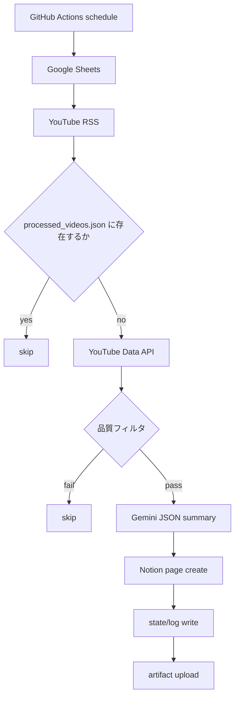

# Integrated Trend Collector v4.1

## 概要
このディレクトリは、元の `n8n` ワークフローを `Python` バッチ + `GitHub Actions` に置き換えた実装です。毎日 `03:00 JST` に実行し、Google Sheets から監視対象 YouTube チャンネル一覧を読み込み、動画を絞り込み、Gemini で日本語要約を作成して Notion に保存します。

## 現在の構成
- `src/trend_collector.py`: バッチ本体
- `config/settings.yaml`: 実行設定
- `state/processed_videos.json`: 処理済み動画 state
- `logs/run_YYYYMMDD_HHMMSS.json`: 実行ログ
- `.github/workflows/integrated-trend-collector.yml`: GitHub Actions 定期実行
- `Integrated Trend Collector v4.1.json`: 元の `n8n` ワークフロー定義

## 処理フロー


## 必須 Secrets
- `GOOGLE_SERVICE_ACCOUNT_JSON`
- `YOUTUBE_API_KEY`
- `GEMINI_API_KEY`
- `NOTION_API_KEY`

`GOOGLE_SERVICE_ACCOUNT_JSON` はサービスアカウント JSON 全体を 1 つの secret に入れる前提です。

## ローカル実行
```bash
python3 -m venv .venv
source .venv/bin/activate
pip install -r requirements.txt
python3 src/trend_collector.py --settings config/settings.yaml
```

## 設定
`config/settings.yaml` で以下を調整できます。
- `google_sheet_id`
- `channel_sheet_range`
- `notion_database_id`
- `min_duration_sec`
- `min_view_count`
- `max_candidates_per_run`
- `processed_retention_days`

## ログと state
- `state/processed_videos.json` は `videoId` ごとに `processed_at`, `channel_id`, `notion_page_id` を保持します。
- 90日を超えた state は次回実行時に自動削除されます。
- `logs/` には毎回の実行要約を保存し、失敗が発生した場合だけ `failed_items` を含めます。

## GitHub Actions
ワークフローは `毎日 03:00 JST` に実行されます。実際の cron は `UTC` で `0 18 * * *` です。毎回、前回の artifact から `state/` と `logs/` を復元し、実行後に新しい artifact をアップロードします。
